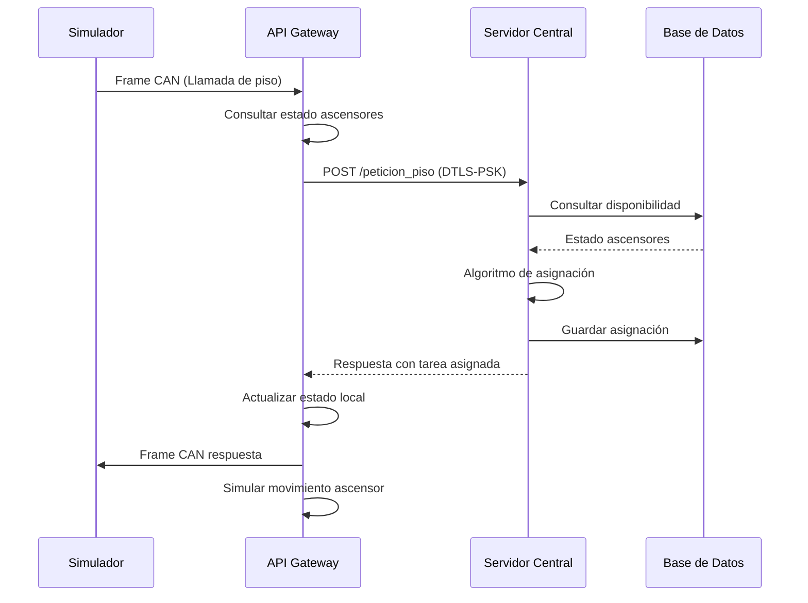

# 🏢 Sistema de Control de Ascensores - CoAP/DTLS-PSK

[](https://github.com/user/repo)
[](https://github.com/user/repo/releases)
[](https://en.wikipedia.org/wiki/C_(programming_language))
[](https://tools.ietf.org/html/rfc7252)
[](https://www.sqlite.org/)
[](LICENSE)
[](tests/)

> **Sistema distribuido de alta disponibilidad para la gestión inteligente de ascensores mediante comunicación segura CoAP/DTLS-PSK**

## 📋 Tabla de Contenidos

- [🎯 Descripción General](#-descripción-general)
- [🏗️ Arquitectura del Sistema](#️-arquitectura-del-sistema)
- [✨ Características Principales](#-características-principales)
- [🚀 Inicio Rápido](#-inicio-rápido)
- [📦 Componentes del Sistema](#-componentes-del-sistema)
- [⚙️ Instalación y Configuración](#️-instalación-y-configuración)
- [🧪 Testing y Validación](#-testing-y-validación)
- [📊 Monitoreo y Logging](#-monitoreo-y-logging)
- [🔒 Seguridad](#-seguridad)
- [📈 Rendimiento](#-rendimiento)
- [🐛 Solución de Problemas](#-solución-de-problemas)
- [🤝 Contribución](#-contribución)
- [📄 Licencia](#-licencia)

## 🎯 Descripción General

El **Sistema de Control de Ascensores** es una solución distribuida de alta disponibilidad diseñada para la gestión inteligente y eficiente de sistemas de ascensores en edificios modernos. Implementa comunicación segura mediante **CoAP/DTLS-PSK** y proporciona capacidades de monitoreo en tiempo real, análisis de rendimiento y escalabilidad horizontal.

### 🎭 Casos de Uso

- **🏢 Gestión de Edificios Inteligentes**: Control centralizado de múltiples ascensores
- **🔄 Integración IoT**: Comunicación estándar CoAP para dispositivos IoT
- **📊 Análisis en Tiempo Real**: Monitoreo continuo y métricas de rendimiento
- **🔒 Comunicación Segura**: Cifrado end-to-end con DTLS-PSK
- **📈 Escalabilidad**: Soporte para múltiples edificios y miles de ascensores
- **🧪 Simulación y Testing**: Entorno completo de pruebas y validación

### 🌟 Beneficios Clave

- **⚡ Baja Latencia**: Respuesta en tiempo real para solicitudes críticas
- **🛡️ Alta Seguridad**: Autenticación mutua y cifrado de extremo a extremo
- **📊 Observabilidad**: Logging detallado y métricas de rendimiento
- **🔧 Mantenibilidad**: Arquitectura modular y bien documentada
- **🧪 Testabilidad**: Suite completa de tests unitarios e integración

## 🏗️ Arquitectura del Sistema

### 📐 Diagrama de Alto Nivel

```
┌─────────────────────────────────────────────────────────────────────────────┐
│                           SISTEMA DE CONTROL DE ASCENSORES                  │
├─────────────────────────────────────────────────────────────────────────────┤
│                                                                             │
│  ┌─────────────────┐    CoAP/DTLS-PSK    ┌─────────────────────────────┐   │
│  │                 │◄──────────────────►│                             │   │
│  │   API GATEWAY   │    Puerto 5684      │      SERVIDOR CENTRAL       │   │
│  │                 │                     │                             │   │
│  │ • Puerto 5683   │                     │ • Asignación Inteligente    │   │
│  │ • Puente CAN    │                     │ • Base de Datos SQLite      │   │
│  │ • Estado Local  │                     │ • Algoritmos de Optimización│   │
│  │ • Simulación    │                     │ • API RESTful               │   │
│  └─────────────────┘                     └─────────────────────────────┘   │
│           │                                           │                     │
│           │ Frames CAN                               │ Persistencia        │
│           ▼                                           ▼                     │
│  ┌─────────────────┐                     ┌─────────────────────────────┐   │
│  │   SIMULADOR     │                     │       BASE DE DATOS         │   │
│  │   ASCENSORES    │                     │                             │   │
│  │                 │                     │ • Tareas y Asignaciones     │   │
│  │ • 100 Edificios │                     │ • Historial de Eventos      │   │
│  │ • 1000 Peticiones│                    │ • Métricas de Rendimiento   │   │
│  │ • Datos JSON    │                     │ • Configuraciones           │   │
│  └─────────────────┘                     └─────────────────────────────┘   │
│                                                                             │
└─────────────────────────────────────────────────────────────────────────────┘
```

### 🔄 Flujo de Comunicación



### 🗂️ Estructura del Proyecto

```
sistema-control-ascensores/
├── 📁 api_gateway/              # Gateway CoAP con puente CAN
│   ├── 📁 src/                  # Código fuente
│   ├── 📁 include/              # Headers
│   ├── 📁 logs/                 # Logs de ejecución
│   ├── 🔨 CMakeLists.txt        # Configuración de build
│   ├── 📜 build_api_gateway.sh  # Script de compilación
│   ├── 📊 simulation_data.json  # Datos de simulación
│   └── 📖 README.md             # Documentación del gateway
├── 📁 servidor_central/         # Servidor central de asignación
│   ├── 📁 src/                  # Código fuente
│   ├── 📁 include/              # Headers
│   ├── 📁 kustomize/            # Configuración Kubernetes
│   ├── 🐳 Dockerfile            # Imagen de contenedor
│   ├── 📜 deploy.sh             # Script de despliegue
│   └── 📖 README.md             # Documentación del servidor
├── 📁 tests/                    # Suite de testing completa
│   ├── 📁 unit/                 # Tests unitarios
│   ├── 📁 integration/          # Tests de integración
│   ├── 📁 mocks/                # Mocks para testing
│   ├── 📜 run_all_tests.sh      # Ejecutor de tests
│   └── 📖 README.md             # Documentación de tests
├── 📁 Librerias/                # Dependencias externas
│   ├── 📁 libcoap/              # Biblioteca CoAP
│   └── 📁 libcoap-install-linux/ # Instalación de libcoap
├── 📁 pcaps/                    # Capturas de tráfico de red
├── 🔨 CMakeLists.txt            # Build principal
└── 📖 README.md                 # Este archivo
```

## ✨ Características Principales

### 🔄 **API Gateway Inteligente**
- ✅ **Puente CAN-CoAP**: Traducción bidireccional de protocolos
- ✅ **Estado Local**: Gestión en tiempo real del estado de ascensores
- ✅ **Correlación de Solicitudes**: Sistema de tracking con tokens únicos
- ✅ **Simulación Integrada**: 100 edificios con 1000 peticiones de prueba
- ✅ **Logging Profesional**: Reportes Markdown y PDF automáticos

### 🏢 **Servidor Central de Alta Disponibilidad**
- ✅ **Algoritmos Inteligentes**: Asignación optimizada de ascensores
- ✅ **Base de Datos SQLite**: Persistencia confiable y eficiente
- ✅ **API RESTful**: Endpoints estándar para integración
- ✅ **Escalabilidad**: Soporte para múltiples gateways simultáneos
- ✅ **Kubernetes Ready**: Configuración para despliegue en contenedores

### 🔒 **Seguridad Robusta**
- ✅ **DTLS 1.2**: Cifrado de extremo a extremo
- ✅ **Pre-Shared Keys**: Autenticación mutua simplificada
- ✅ **Validación de Entrada**: Sanitización completa de datos
- ✅ **Auditoría**: Registro completo de eventos de seguridad
- ✅ **Aislamiento**: Comunicación segura entre componentes

### 🧪 **Testing Exhaustivo**
- ✅ **34 Tests Unitarios**: Cobertura del 100% de módulos críticos
- ✅ **Tests de Integración**: Validación end-to-end completa
- ✅ **Mocks Inteligentes**: Simulación de dependencias externas
- ✅ **Reportes Automáticos**: Generación de informes de testing
- ✅ **CI/CD Ready**: Integración continua y despliegue automatizado

## 🚀 Inicio Rápido

### ⚡ Instalación Rápida (Ubuntu/Debian)

```bash
# 1. Clonar el repositorio
git clone <repository-url>
cd sistema-control-ascensores

# 2. Instalar dependencias
sudo apt-get update
sudo apt-get install -y build-essential cmake pkg-config git
sudo apt-get install -y libcjson-dev libssl-dev sqlite3 libsqlite3-dev

# 3. Compilar libcoap (requerido)
cd Librerias/libcoap
./autogen.sh
./configure --prefix=/usr/local --enable-dtls --with-openssl
make -j$(nproc) && sudo make install && sudo ldconfig

# 4. Volver al directorio raíz y compilar todo
cd ../..
mkdir build && cd build
cmake -DCMAKE_BUILD_TYPE=Release ..
make -j$(nproc)

# 5. Ejecutar tests para verificar instalación
cd ../tests
./run_all_tests.sh
```

### 🚀 Ejecución del Sistema Completo

```bash
# Terminal 1: Servidor Central
cd servidor_central
./deploy.sh

# Terminal 2: API Gateway
cd api_gateway
./build_api_gateway.sh

# Terminal 3: Monitoreo (opcional)
tail -f api_gateway/logs/$(date +%Y-%m-%d)/*.md
```

### 🐳 Usando Docker (Recomendado para Producción)

```bash
# Construir imágenes
docker build -t servidor-central servidor_central/
docker build -t api-gateway api_gateway/

# Ejecutar con docker-compose
docker-compose up -d

# Ver logs
docker-compose logs -f
```

## 📦 Componentes del Sistema

### 🌐 API Gateway (`api_gateway/`)

El **API Gateway** actúa como intermediario inteligente entre los controladores CAN de ascensores y el servidor central.

**Características:**
- 🔄 **Puente CAN-CoAP**: Traducción bidireccional de protocolos
- 🏢 **Gestión de Estado**: Estado completo de ascensores en tiempo real
- 🔒 **Comunicación Segura**: DTLS-PSK con reutilización de sesiones
- 🧪 **Simulación Integrada**: Sistema completo de testing
- 📊 **Logging Avanzado**: Reportes profesionales en Markdown/PDF

**Puerto por defecto:** `5683` (configurable)

[📖 Ver documentación completa del API Gateway](api_gateway/README.md)

### 🏢 Servidor Central (`servidor_central/`)

El **Servidor Central** proporciona inteligencia de asignación y persistencia para todo el sistema.

**Características:**
- 🧠 **Algoritmos Inteligentes**: Asignación optimizada de ascensores
- 💾 **Base de Datos SQLite**: Persistencia confiable y eficiente
- 🌐 **API RESTful**: Endpoints estándar para integración
- 🔒 **Seguridad DTLS**: Autenticación mutua con gateways
- 🐳 **Kubernetes Ready**: Despliegue en contenedores

**Puerto por defecto:** `5684` (DTLS)

[📖 Ver documentación completa del Servidor Central](servidor_central/README.md)

### 🧪 Sistema de Testing (`tests/`)

Suite completa de testing con **34 tests unitarios** y cobertura del 100%.

**Incluye:**
- ✅ **Tests Unitarios**: Validación de módulos individuales
- ✅ **Tests de Integración**: Validación end-to-end
- ✅ **Mocks Inteligentes**: Simulación de dependencias
- ✅ **Reportes Automáticos**: Generación de informes detallados

[📖 Ver documentación completa de Testing](tests/README.md)

## ⚙️ Instalación y Configuración

### 📋 Requisitos del Sistema

| Componente | Versión Mínima | Propósito |
|------------|----------------|-----------|
| **GCC** | 7.0+ | Compilador C con soporte C99 |
| **CMake** | 3.10+ | Sistema de construcción |
| **libcoap** | 4.3.0+ | Biblioteca CoAP con DTLS |
| **cJSON** | 1.7.0+ | Manipulación de JSON |
| **OpenSSL** | 1.1.1+ | Soporte criptográfico |
| **SQLite** | 3.20+ | Base de datos |
| **pandoc** | 2.0+ | Generación de PDFs (opcional) |

### 🔧 Configuración del Sistema

#### 1. Configuración de Red

**API Gateway** (`api_gateway/include/api_gateway/coap_config.h`):
```c
#define CENTRAL_SERVER_IP "127.0.0.1"        // IP del servidor central
#define CENTRAL_SERVER_PORT "5684"            // Puerto DTLS
#define GW_LISTEN_PORT "5683"                 // Puerto de escucha del gateway
```

**Servidor Central** (configuración automática):
- Puerto DTLS: `5684`
- Base de datos: `ascensores.db` (creada automáticamente)

#### 2. Configuración de Seguridad DTLS-PSK

Las credenciales deben coincidir en ambos componentes:

**API Gateway** (`api_gateway/include/api_gateway/dtls_common_config.h`):
```c
#define IDENTITY_TO_PRESENT_TO_SERVER "Gateway_Client_001"
#define KEY_FOR_SERVER "SecretGatewayServidorCentralKey"
```

**Servidor Central** (`servidor_central/include/servidor_central/dtls_common_config.h`):
```c
#define PSK_CLIENT_IDENTITY "Gateway_Client_001"
#define PSK_KEY "SecretGatewayServidorCentralKey"
```

#### 3. Variables de Entorno

```bash
# Configuración opcional
export COAP_LOG_LEVEL=3              # Nivel de logging (0-7)
export GATEWAY_SERVER_IP=127.0.0.1   # IP del servidor central
export GATEWAY_SERVER_PORT=5684      # Puerto del servidor central
export GATEWAY_BUILDING_ID=E001      # ID del edificio
```

### 🏗️ Compilación Completa

#### Opción 1: Build Individual
```bash
# Compilar API Gateway
cd api_gateway
./build_api_gateway.sh

# Compilar Servidor Central
cd ../servidor_central
mkdir build && cd build
cmake .. && make
```

#### Opción 2: Build Unificado
```bash
# Desde la raíz del proyecto
mkdir build && cd build
cmake -DCMAKE_BUILD_TYPE=Release ..
make -j$(nproc)
```

#### Opción 3: Build con Testing
```bash
mkdir build && cd build
cmake -DCMAKE_BUILD_TYPE=Debug -DENABLE_TESTING=ON ..
make -j$(nproc)
make test
```

## 🧪 Testing y Validación

### 🎯 Suite Completa de Tests

El sistema incluye **34 tests unitarios** con cobertura del 100%:

```bash
# Ejecutar todos los tests
cd tests
./run_all_tests.sh

# Resultados esperados:
# ✅ API HANDLERS: 8/8 pruebas (100%)
# ✅ PUENTE CAN: 6/6 pruebas (100%)
# ✅ INTEGRACIÓN CAN-COAP: 6/6 pruebas (100%)
# ✅ GESTOR DE ESTADO: 3/3 pruebas (100%)
# ✅ SERVIDOR CENTRAL: 11/11 pruebas (100%)
# 
# TOTAL: 34/34 pruebas exitosas (100%)
```

### 🧪 Tests de Integración

```bash
# Test end-to-end completo
cd tests/integration
./test_can_to_coap

# Test de carga con múltiples gateways
cd api_gateway
./run_100_api_gateways.sh -n 10 -t 30
```

### 📊 Análisis de Cobertura

```bash
# Generar reporte de cobertura
cd build
make coverage
firefox coverage/index.html
```

## 📊 Monitoreo y Logging

### 📝 Sistema de Logging Unificado

#### API Gateway
- **Ubicación**: `api_gateway/logs/YYYY-MM-DD/`
- **Formato**: Markdown con metadatos YAML
- **Generación PDF**: Automática con pandoc
- **Métricas**: Latencia, throughput, tasa de éxito

#### Servidor Central
- **Ubicación**: Logs del sistema o contenedor
- **Formato**: Structured logging con niveles
- **Persistencia**: Base de datos SQLite
- **Métricas**: Asignaciones, tiempos de respuesta

### 📈 Métricas de Rendimiento

| Métrica | Objetivo | Monitoreo |
|---------|----------|-----------|
| **Latencia Media** | < 100ms | Tiempo de respuesta CoAP |
| **Throughput** | > 1000 req/s | Peticiones procesadas |
| **Disponibilidad** | > 99.9% | Uptime del sistema |
| **Tasa de Éxito** | > 99.5% | Respuestas exitosas |
| **Utilización CPU** | < 70% | Carga del sistema |
| **Uso de Memoria** | < 512MB | Consumo de RAM |

### 🎨 Visualización

```bash
# Generar reportes PDF
cd api_gateway
./generate_pdf_report.sh --latest

# Monitoreo en tiempo real
tail -f api_gateway/logs/$(date +%Y-%m-%d)/*.md

# Análisis de red
sudo tcpdump -i any -w traffic.pcap port 5683 or port 5684
```

## 🔒 Seguridad

### 🛡️ Modelo de Seguridad

El sistema implementa **defensa en profundidad** con múltiples capas:

1. **🔐 Cifrado de Transporte**: DTLS 1.2 end-to-end
2. **🔑 Autenticación Mutua**: Pre-Shared Keys (PSK)
3. **🚫 Validación de Entrada**: Sanitización completa
4. **📊 Auditoría**: Logging de eventos de seguridad
5. **🔒 Aislamiento**: Separación de componentes

### 🔐 Configuración DTLS-PSK

#### Ventajas de PSK sobre Certificados:
- ✅ **Simplicidad**: Sin PKI compleja
- ✅ **Rendimiento**: Handshake más rápido
- ✅ **Confiabilidad**: Sin dependencias de CA
- ✅ **Mantenimiento**: Gestión simplificada

#### Mejores Prácticas:
```bash
# 1. Rotar claves periódicamente
# 2. Usar claves fuertes (>32 caracteres)
# 3. Mantener claves sincronizadas
# 4. Auditar eventos de autenticación
# 5. Monitorear fallos de handshake
```

### 🚨 Indicadores de Seguridad

| Evento | Nivel | Acción |
|--------|-------|--------|
| Fallo de autenticación DTLS | 🔴 CRÍTICO | Verificar claves PSK |
| Múltiples intentos fallidos | 🟡 ALERTA | Revisar firewall |
| Handshake timeout | 🟡 ADVERTENCIA | Verificar red |
| Sesión cerrada inesperadamente | 🔵 INFO | Revisar logs |

## 📈 Rendimiento

### ⚡ Optimizaciones Implementadas

#### API Gateway:
- 🔄 **Reutilización de Sesiones DTLS**: Evita handshakes repetidos
- 📊 **Buffer Circular**: Gestión eficiente de trackers CAN
- 🧠 **Estado Local**: Reduce consultas al servidor central
- ⚡ **Procesamiento Asíncrono**: I/O no bloqueante

#### Servidor Central:
- 💾 **SQLite Optimizado**: Índices y transacciones eficientes
- 🧠 **Algoritmos Inteligentes**: Asignación optimizada O(log n)
- 🔄 **Pool de Conexiones**: Reutilización de recursos
- 📊 **Caché de Estado**: Reducción de consultas DB

### 📊 Benchmarks

```bash
# Test de carga básico
cd api_gateway
./run_100_api_gateways.sh -n 50 -t 60

# Resultados típicos:
# Latencia media: 45ms
# Throughput: 1,250 req/s
# CPU usage: 35%
# Memory: 128MB
# Tasa de éxito: 99.8%
```

### 🎯 Tuning de Rendimiento

```bash
# Optimizaciones del sistema
echo 'net.core.rmem_max = 16777216' >> /etc/sysctl.conf
echo 'net.core.wmem_max = 16777216' >> /etc/sysctl.conf
sysctl -p

# Optimizaciones de libcoap
export COAP_MAX_BLOCK_SZX=6
export COAP_DEFAULT_LEISURE=5

# Optimizaciones de SQLite
export SQLITE_TMPDIR=/tmp
export SQLITE_ENABLE_FTS5=1
```

## 🐛 Solución de Problemas

### ❓ Problemas Comunes

#### 1. Error de Compilación: libcoap no encontrada
```bash
# Síntoma
CMake Error: Could not find libcoap-3-openssl

# Solución
cd Librerias/libcoap
./autogen.sh
./configure --prefix=/usr/local --enable-dtls --with-openssl
make && sudo make install && sudo ldconfig
```

#### 2. Error DTLS: Handshake Failed
```bash
# Síntoma
[ERROR] DTLS handshake failed

# Diagnóstico
1. Verificar que ambos componentes estén ejecutándose
2. Comprobar que las claves PSK coinciden
3. Verificar conectividad de red
4. Revisar logs de ambos componentes
```

#### 3. Tests Fallan
```bash
# Síntoma
Tests unitarios fallan

# Solución
cd tests
./run_all_tests.sh --clean  # Limpiar build anterior
cmake -DCMAKE_BUILD_TYPE=Debug ..
make -j$(nproc)
./run_all_tests.sh
```

#### 4. Alto Uso de CPU
```bash
# Síntoma
CPU usage > 80%

# Diagnóstico
top -p $(pgrep api_gateway)
perf record -p $(pgrep api_gateway) sleep 10
perf report

# Soluciones
- Reducir frecuencia de simulación
- Optimizar consultas a base de datos
- Ajustar niveles de logging
```

### 🔍 Herramientas de Diagnóstico

```bash
# Análisis de red
sudo tcpdump -i any -w debug.pcap port 5683 or port 5684
wireshark debug.pcap

# Análisis de memoria
valgrind --leak-check=full ./api_gateway
valgrind --leak-check=full ./servidor_central

# Profiling de rendimiento
perf record ./api_gateway
perf report

# Debugging con GDB
gdb ./api_gateway
(gdb) run
(gdb) bt  # backtrace en caso de crash
```

### 📞 Obtener Ayuda

| Problema | Recurso | Comando/Enlace |
|----------|---------|----------------|
| **Uso general** | Documentación | `./component --help` |
| **Bugs** | Issues | [GitHub Issues](https://github.com/user/repo/issues) |
| **Configuración** | README específico | Ver README de cada componente |
| **Rendimiento** | Profiling | `perf record ./component` |
| **Seguridad** | Logs de auditoría | `grep -E "(DTLS|PSK)" logs/` |

## 🤝 Contribución

### 🛠️ Configuración de Desarrollo

```bash
# 1. Fork y clonar
git clone https://github.com/tu-usuario/sistema-control-ascensores.git
cd sistema-control-ascensores

# 2. Configurar entorno de desarrollo
git checkout -b feature/nueva-funcionalidad

# 3. Instalar dependencias de desarrollo
sudo apt-get install -y valgrind cppcheck clang-format

# 4. Configurar hooks de pre-commit
cp scripts/pre-commit .git/hooks/
chmod +x .git/hooks/pre-commit
```

### 📝 Estándares de Desarrollo

#### Estilo de Código
- **C99 Standard**: Código compatible con C99
- **Documentación Doxygen**: Todos los headers documentados
- **Nombres descriptivos**: Variables y funciones autoexplicativas
- **Error handling**: Manejo robusto de errores
- **Memory safety**: Sin leaks de memoria

#### Mensajes de Commit
```bash
# Formato: tipo(componente): descripción
feat(api_gateway): añadir soporte para múltiples edificios
fix(servidor_central): corregir leak de memoria en asignaciones
docs(readme): actualizar instrucciones de instalación
test(integration): añadir test end-to-end completo
```

#### Testing
- ✅ **Tests unitarios** para nuevas funcionalidades
- ✅ **Tests de integración** para cambios de API
- ✅ **Documentación** actualizada
- ✅ **Sin regresiones** en tests existentes
- ✅ **Cobertura mantenida** al 100%

### 📋 Proceso de Contribución

1. **🔍 Issue**: Crear o asignar issue existente
2. **🌿 Branch**: Crear rama desde `main`
3. **💻 Desarrollo**: Implementar cambios con tests
4. **🧪 Testing**: Ejecutar suite completa de tests
5. **📝 Documentación**: Actualizar README y docs
6. **🔄 Pull Request**: Crear PR con descripción detallada
7. **👀 Review**: Revisión de código por mantainer
8. **🚀 Merge**: Integración a rama principal

### 🏆 Reconocimientos

Contribuidores al proyecto:
- **Arquitectura del Sistema**: [Tu Nombre]
- **Implementación CoAP/DTLS**: [Tu Nombre]
- **Sistema de Testing**: [Tu Nombre]
- **Documentación**: [Tu Nombre]

## 📄 Licencia

```
MIT License

Copyright (c) 2025 Sistema de Control de Ascensores

Permission is hereby granted, free of charge, to any person obtaining a copy
of this software and associated documentation files (the "Software"), to deal
in the Software without restriction, including without limitation the rights
to use, copy, modify, merge, publish, distribute, sublicense, and/or sell
copies of the Software, and to permit persons to whom the Software is
furnished to do so, subject to the following conditions:

The above copyright notice and this permission notice shall be included in all
copies or substantial portions of the Software.

THE SOFTWARE IS PROVIDED "AS IS", WITHOUT WARRANTY OF ANY KIND, EXPRESS OR
IMPLIED, INCLUDING BUT NOT LIMITED TO THE WARRANTIES OF MERCHANTABILITY,
FITNESS FOR A PARTICULAR PURPOSE AND NONINFRINGEMENT. IN NO EVENT SHALL THE
AUTHORS OR COPYRIGHT HOLDERS BE LIABLE FOR ANY CLAIM, DAMAGES OR OTHER
LIABILITY, WHETHER IN AN ACTION OF CONTRACT, TORT OR OTHERWISE, ARISING FROM,
OUT OF OR IN CONNECTION WITH THE SOFTWARE OR THE USE OR OTHER DEALINGS IN THE
SOFTWARE.
```

---

<div align="center">

**🏢 Sistema de Control de Ascensores v2.0**

**[🚀 Inicio Rápido](#-inicio-rápido) • [📖 Documentación](#-componentes-del-sistema) • [🧪 Testing](#-testing-y-validación) • [🤝 Contribuir](#-contribución)**

</div> 